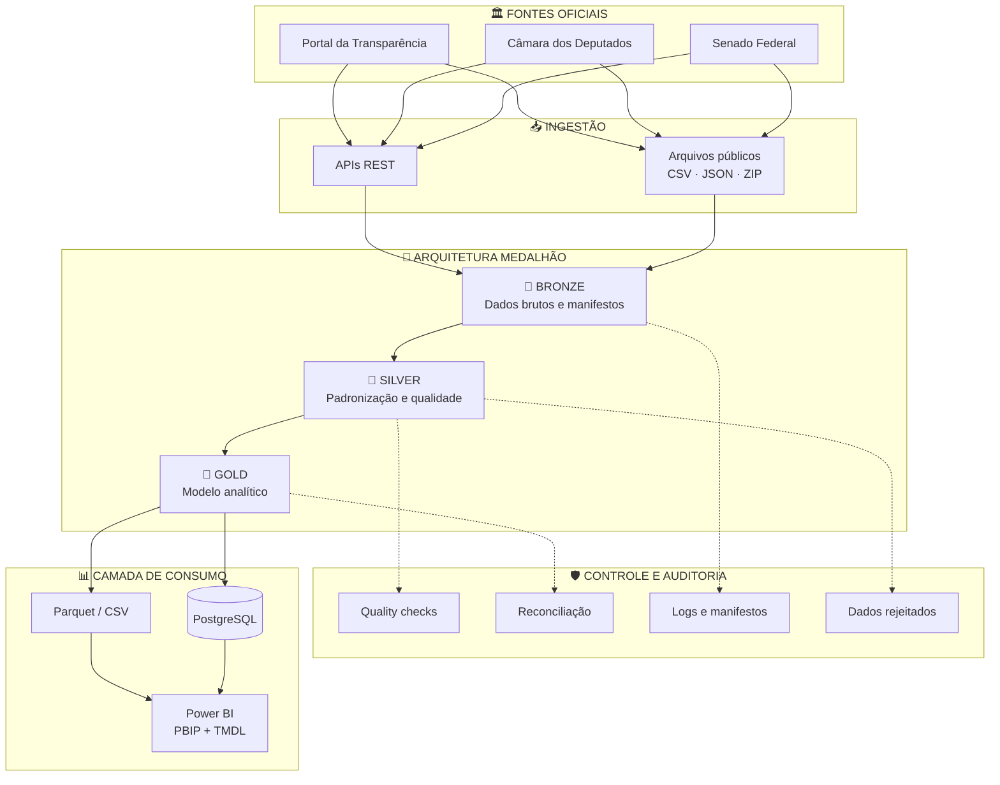
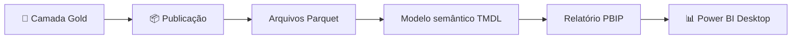
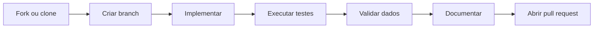

<div align="center">

<br>

# 🏛️ Observatório Político Brasil

### Engenharia de dados aplicada à transparência pública brasileira

Plataforma open source para **coletar, organizar, validar e analisar dados públicos oficiais**, utilizando pipelines reproduzíveis, arquitetura medalhão, controle de qualidade e modelo semântico versionável no Power BI.

<br>


<br>

**Portal da Transparência** · **Câmara dos Deputados** · **Senado Federal**

<br>

[Visão geral](#-visão-geral) ·
[Arquitetura](#-arquitetura-da-plataforma) ·
[Domínios](#-fontes-e-domínios) ·
[Execução](#-execução-dos-pipelines) ·
[Power BI](#-power-bi) ·
[Contribuição](#-contribuição)

<br>

</div>

---

## 📌 Visão geral

<table>
<tr>
<td width="68%">

O **Observatório Político Brasil** é uma plataforma de engenharia de dados criada para consolidar informações públicas provenientes de fontes oficiais do Governo Federal e do Poder Legislativo.

Os dados são coletados, preservados, padronizados, validados e transformados em estruturas analíticas preparadas para consumo por meio de:

- Power BI;
- consultas SQL;
- arquivos Parquet;
- arquivos CSV;
- aplicações analíticas;
- pesquisas e auditorias independentes.

</td>
<td width="32%" align="center">

### 🎯 Propósito

Transformar dados públicos dispersos em informações:

**estruturadas**

**rastreáveis**

**auditáveis**

**reproduzíveis**

</td>
</tr>
</table>

### Objetivos do projeto

| Objetivo | Aplicação prática |
|---|---|
| **Centralizar fontes oficiais** | Integrar dados de diferentes órgãos em uma estrutura padronizada |
| **Preservar a origem** | Manter arquivos brutos e manifestos de execução |
| **Garantir rastreabilidade** | Registrar origem, período, execução e regras de transformação |
| **Produzir dados analíticos** | Construir fatos, dimensões, rankings e relacionamentos |
| **Permitir auditoria** | Disponibilizar reconciliações e validações entre camadas |
| **Apoiar o controle social** | Facilitar a exploração de dados públicos por qualquer interessado |

> [!IMPORTANT]
> O projeto possui caráter técnico, informativo e apartidário.  
> Os indicadores são construídos a partir de dados oficiais e não representam apoio, oposição ou preferência por partidos, parlamentares, candidatos ou instituições.

---

## 🧭 Princípios de engenharia

| Princípio | Como é aplicado |
|:---:|---|
| 🏛️ **Fonte oficial** | Dados obtidos diretamente de APIs, arquivos e portais institucionais |
| 🔁 **Reprodutibilidade** | Pipelines executáveis a partir do código e das configurações versionadas |
| 🔎 **Rastreabilidade** | Manifestos, partições, logs e identificadores de execução |
| ✅ **Qualidade** | Validações técnicas e regras de consistência entre camadas |
| ⚖️ **Neutralidade** | Apresentação dos dados sem orientação político-partidária |
| 🔐 **Segurança** | Credenciais e informações sensíveis fora do controle de versão |
| 📚 **Documentação** | Regras de negócio e fontes documentadas junto ao código |
| 🧩 **Modularidade** | Pipelines separados por fonte, domínio e responsabilidade |

---

## 🏗️ Arquitetura da plataforma



### Fluxo de processamento

| Etapa | Entrada | Responsabilidade | Saída |
|---:|---|---|---|
| **1. Extração** | APIs e arquivos oficiais | Obter os dados das fontes institucionais | Respostas JSON, CSV e arquivos compactados |
| **2. Bronze** | Dados originais | Preservar o conteúdo com máxima fidelidade | Dados brutos particionados e manifestos |
| **3. Silver** | Dados brutos | Limpar, tipar, normalizar e validar | Dados padronizados |
| **4. Gold** | Dados padronizados | Construir o modelo analítico | Fatos, dimensões, rankings e resumos |
| **5. Qualidade** | Todas as camadas | Validar contagens, chaves e consistência | Relatórios e reconciliações |
| **6. Publicação** | Camada Gold | Preparar dados para análise | PostgreSQL, Parquet, CSV e Power BI |

---

## 🏅 Arquitetura medalhão

<table>
<tr>
<td width="33%" valign="top">

### 🥉 Bronze

**Ingestão e preservação**

Mantém os dados com o maior nível possível de fidelidade à origem.

- arquivos originais;
- respostas de APIs;
- arquivos ZIP;
- partições temporais;
- manifestos de execução;
- possibilidade de reprocessamento.

</td>
<td width="33%" valign="top">

### 🥈 Silver

**Padronização e qualidade**

Aplica as transformações técnicas necessárias para tornar os dados consistentes.

- normalização de colunas;
- conversão de tipos;
- tratamento de nulos;
- remoção de duplicidades;
- padronização de chaves;
- controle de rejeições.

</td>
<td width="33%" valign="top">

### 🥇 Gold

**Modelo analítico**

Disponibiliza estruturas preparadas para análise e visualização.

- tabelas fato;
- dimensões;
- rankings;
- resumos periódicos;
- relacionamentos;
- reconciliações.

</td>
</tr>
</table>

---

## 🏛️ Fontes e domínios

### Portal da Transparência

| Domínio | Conteúdo |
|---|---|
| **Emendas parlamentares** | Valores empenhados, liquidados, pagos e restos a pagar |
| **Favorecidos** | Pessoas e empresas beneficiárias de recursos |
| **Convênios** | Convenentes, objetos, valores, funções e localidades |
| **Contratos** | Contratados, órgãos, itens, vigência e alterações |
| **Licitações** | Modalidades, participantes, itens e empenhos relacionados |
| **Órgãos SIAFI** | Estrutura dos órgãos e unidades governamentais |

### Câmara dos Deputados

| Domínio | Conteúdo |
|---|---|
| **Gastos parlamentares** | Despesas, fornecedores, partidos, estados e tipos de despesa |
| **Proposições** | Projetos, autores, temas, órgãos e tramitação |
| **Votações** | Resultados, orientações, objetos e proposições relacionadas |
| **Votos** | Posicionamento individual dos deputados |
| **Rankings descritivos** | Gastos, fornecedores, temas, autores e participação |

### Senado Federal

| Domínio | Conteúdo |
|---|---|
| **Senadores** | Cadastro e composição atual |
| **CEAPS** | Despesas dos senadores |
| **Empresas contratadas** | Fornecedores e prestadores |
| **Matérias legislativas** | Proposições e atividades legislativas |
| **Votações** | Registros de votações do Senado |

---

## 📊 Produtos analíticos

| Domínio | Fatos e relacionamentos | Rankings e resumos |
|---|---|---|
| **Emendas** | Fato de emendas, favorecidos e distribuição territorial | Autores, funções, municípios e UFs |
| **Convênios** | Fato de convênios e relacionamento emenda-convênio | Convenentes, funções e localidades |
| **Contratos** | Contratos, itens, termos e relacionamento órgão-contratado | Contratados, órgãos e variações |
| **Licitações** | Licitações, itens, participantes e empenhos | Órgãos, fornecedores e modalidades |
| **Gastos dos deputados** | Fato de gastos parlamentares | Deputados, partidos, fornecedores e despesas |
| **Proposições e votações** | Fatos de proposições, votações e votos | Autores, temas, partidos e deputados |
| **Senado Federal** | Despesas, matérias e votações | Senadores, fornecedores e atividade |

---

## 🚦 Status do projeto

| Componente | Estado | Observação |
|---|:---:|---|
| Emendas parlamentares | ✅ | Pipeline implementado |
| Favorecidos | ✅ | Pipeline implementado |
| Convênios | ✅ | Pipeline implementado |
| Contratos | ✅ | Pipeline implementado |
| Licitações | ✅ | Pipeline implementado |
| Gastos dos deputados | ✅ | Pipeline implementado |
| Proposições da Câmara | ✅ | Disponível para consumo analítico |
| Votações da Câmara | ✅ | Disponível para consumo analítico |
| Dados do Senado | ✅ | Disponível para consumo analítico |
| Manifestos de execução | ✅ | Implementados nos principais pipelines |
| Reconciliações | ✅ | Disponíveis nos domínios analíticos |
| Projeto Power BI PBIP | ✅ | Versionado no Git |
| Modelo semântico | 🟡 | Em evolução |
| Páginas executivas | 🟡 | Em desenvolvimento |
| Automação completa | 🔵 | Planejada |

**Legenda:** ✅ concluído · 🟡 em evolução · 🔵 planejado

---

## 🧰 Stack tecnológica

<div align="center">


</div>

| Categoria | Tecnologias e padrões |
|---|---|
| **Linguagem** | Python |
| **Dependências** | uv e `pyproject.toml` |
| **Processamento** | Polars e bibliotecas do ecossistema Python |
| **Integração** | APIs REST e arquivos públicos |
| **Armazenamento** | Parquet, CSV e JSON |
| **Persistência** | PostgreSQL |
| **Visualização** | Power BI Desktop |
| **Modelo semântico** | PBIP e TMDL |
| **Qualidade** | Manifestos, validações e reconciliações |
| **Testes** | pytest |
| **Qualidade de código** | Ruff e mypy |
| **Versionamento** | Git e GitHub |

---

## 📁 Estrutura do repositório

Em vez de apresentar uma árvore extensa e difícil de ler, a estrutura principal é documentada por responsabilidade.

| Diretório ou arquivo | Responsabilidade |
|---|---|
| `src/` | Código-fonte dos pipelines e regras de transformação |
| `scripts/` | Scripts operacionais, publicações e geração do modelo semântico |
| `tests/` | Testes automatizados |
| `sql/` | Scripts SQL e objetos de banco |
| `data/bronze/` | Dados brutos preservados |
| `data/silver/` | Dados normalizados e validados |
| `data/gold/` | Modelo analítico e produtos de consumo |
| `data/rejected/` | Registros rejeitados pelas validações |
| `output/power_bi/` | Arquivos publicados para consumo no Power BI |
| `output/auditoria/` | Evidências e resultados de auditoria |
| `docs/` | Documentação técnica e funcional |
| `logs/` | Logs locais de execução |
| `powerbi/` | Configurações e recursos auxiliares do Power BI |
| `painel_portal_transparencia.Report/` | Definição versionável do relatório |
| `painel_portal_transparencia.SemanticModel/` | Modelo semântico, medidas e relacionamentos |
| `painel_portal_transparencia.pbip` | Arquivo de abertura do projeto Power BI |
| `pyproject.toml` | Dependências e configuração do projeto Python |
| `uv.lock` | Lock file das dependências |
| `exemple_env.txt` | Exemplo das variáveis de ambiente |

<details>
<summary><strong>📂 Visualizar estrutura lógica resumida</strong></summary>

<br>

```text
observatorio-politico-brasil/
│
├── src/                              # Código-fonte
├── scripts/                          # Scripts operacionais
├── tests/                            # Testes automatizados
├── sql/                              # Scripts SQL
├── docs/                             # Documentação
├── logs/                             # Logs locais
│
├── data/
│   ├── bronze/
│   │   ├── portal_transparencia/
│   │   ├── camara_deputados/
│   │   └── senado_federal/
│   │
│   ├── silver/
│   │   ├── portal_transparencia/
│   │   ├── camara_deputados/
│   │   └── senado_federal/
│   │
│   ├── gold/
│   │   ├── portal_transparencia/
│   │   ├── camara_deputados/
│   │   └── senado_federal/
│   │
│   └── rejected/
│
├── output/
│   ├── power_bi/
│   ├── auditoria/
│   └── backup_modelo_semantico/
│
├── painel_portal_transparencia.Report/
├── painel_portal_transparencia.SemanticModel/
├── painel_portal_transparencia.pbip
│
├── pyproject.toml
├── uv.lock
├── exemple_env.txt
└── README.md
```

</details>

### Convenção de armazenamento

| Camada | Padrão lógico |
|---|---|
| Bronze | `data/bronze/<fonte>/<dominio>/<particoes>/` |
| Silver | `data/silver/<fonte>/<dominio>/<periodo>/` |
| Gold | `data/gold/<fonte>/<dominio>/<periodo>/` |
| Rejeitados | `data/rejected/<fonte>/<dominio>/` |
| Power BI | `output/power_bi/<dominio>/` |

Exemplo de particionamento:

```text
data/
└── bronze/
    └── portal_transparencia/
        └── contratos/
            └── ano=2026/
                └── mes=07/
                    └── execucao=20260729T220000Z/
```

---

## ⚙️ Configuração do ambiente

### Pré-requisitos

| Requisito | Finalidade |
|---|---|
| **Git** | Clonar e versionar o projeto |
| **Python** | Executar os pipelines |
| **uv** | Gerenciar dependências e ambiente virtual |
| **Power BI Desktop** | Abrir e editar o projeto PBIP |
| **PostgreSQL** | Persistência analítica, quando habilitada |
| **Conta Gov.br** | Gerar a chave da API do Portal da Transparência |

### 1. Clonar o projeto

```bash
git clone <URL_DO_REPOSITORIO>
cd observatorio-politico-brasil
```

### 2. Instalar as dependências

```bash
uv sync
```

### 3. Criar o arquivo `.env`

#### Windows — PowerShell

```powershell
Copy-Item .\exemple_env.txt .\.env
```

#### Linux ou macOS

```bash
cp exemple_env.txt .env
```

> [!WARNING]
> O arquivo `.env` deve permanecer apenas na máquina do colaborador.  
> Nunca envie esse arquivo ao GitHub.

Confirme que o `.gitignore` contém:

```gitignore
.env
.env.*
!.env.example
```

---

## 🔑 Chave da API do Portal da Transparência

Cada colaborador deve gerar sua própria chave de acesso.

| Recurso | Endereço |
|---|---|
| Gerar chave | [Cadastro da API](https://portaldatransparencia.gov.br/api-de-dados/cadastrar-email) |
| Swagger | [Documentação técnica](https://api.portaldatransparencia.gov.br/) |
| Informações gerais | [API de Dados](https://portaldatransparencia.gov.br/api-de-dados) |

### Procedimento

1. Acesse a página de cadastro.
2. Autentique-se utilizando sua conta Gov.br.
3. Conclua os requisitos de segurança solicitados.
4. Aguarde o recebimento da chave no e-mail cadastrado.
5. Adicione a chave ao arquivo `.env`.

```env
PORTAL_TRANSPARENCIA_API_KEY=sua_chave_aqui
```

### Uso correto

```python
import os

api_key = os.getenv("PORTAL_TRANSPARENCIA_API_KEY")

if not api_key:
    raise RuntimeError(
        "A variável PORTAL_TRANSPARENCIA_API_KEY não foi configurada."
    )
```

### Uso incorreto

```python
# Nunca faça isso
API_KEY = "minha-chave-real"
```

---

## ▶️ Execução dos pipelines

### Consultar os comandos disponíveis

```bash
uv run python -m observatorio_politico.main --help
```

### Pipeline do Senado Federal

| Etapa | Comando |
|---|---|
| Bronze | `uv run python -m observatorio_politico.main senado-bronze` |
| Silver | `uv run python -m observatorio_politico.main senado-silver` |
| Gold | `uv run python -m observatorio_politico.main senado-gold` |
| Qualidade | `uv run python -m observatorio_politico.main senado-quality` |
| Dimensões | `uv run python -m observatorio_politico.main senado-dimensions` |
| Publicação Power BI | `uv run python .\scripts\publicar_senado_power_bi.py` |

Ou execute individualmente:

```powershell
uv run python -m observatorio_politico.main senado-bronze
uv run python -m observatorio_politico.main senado-silver
uv run python -m observatorio_politico.main senado-gold
uv run python -m observatorio_politico.main senado-quality
uv run python -m observatorio_politico.main senado-dimensions

uv run python .\scripts\publicar_senado_power_bi.py
```

### Gastos dos deputados

Após a execução do pipeline, confirme a publicação dos arquivos em:

```text
output/power_bi/gastos_deputados/
```

### Testes automatizados

```bash
uv run pytest
```

### Validação de código

```bash
uv run ruff check .
uv run mypy src
```

> [!TIP]
> Antes de abrir um pull request, execute os testes, valide os manifestos e confira as reconciliações do domínio alterado.

---

## 🛡️ Qualidade e rastreabilidade

<table>
<tr>
<td width="50%" valign="top">

### 📜 Manifestos

Os pipelines registram informações de execução por meio de manifestos.

```text
bronze.manifest.json
silver.manifest.json
gold.manifest.json
quality.manifest.json
reconciliation.manifest.json
dimensions.manifest.json
execucao.manifest.json
```

</td>
<td width="50%" valign="top">

### 🔍 Informações registradas

- período processado;
- origem dos dados;
- identificador da execução;
- quantidade de registros;
- arquivos produzidos;
- validações realizadas;
- status do processamento.

</td>
</tr>
</table>

### Reconciliações

| Reconciliação | Finalidade |
|---|---|
| `reconciliacao_emendas` | Comparar dados processados de emendas |
| `reconciliacao_convenios` | Validar dados e relacionamentos de convênios |
| `reconciliacao_contratos` | Conferir contratos, itens e valores |
| `reconciliacao_licitacoes` | Validar licitações e entidades relacionadas |
| `reconciliacao_gastos_deputados` | Conferir os gastos parlamentares processados |

### Dados rejeitados

Registros que não atendem às regras mínimas de qualidade podem ser gravados em:

```text
data/rejected/
```

Cada rejeição deve informar:

| Informação | Descrição |
|---|---|
| **Origem** | Arquivo ou endpoint de origem |
| **Execução** | Identificador da carga |
| **Motivo** | Regra de qualidade não atendida |
| **Registro** | Dados necessários para investigação |
| **Data** | Momento em que ocorreu a rejeição |

---

## 📊 Power BI

<table>
<tr>
<td width="67%" valign="top">

O projeto utiliza o formato **Power BI Project (`.pbip`)**, permitindo que o relatório e o modelo semântico sejam versionados no Git.

Essa abordagem permite acompanhar alterações em:

- páginas e visuais;
- medidas DAX;
- tabelas;
- relacionamentos;
- partições;
- culturas;
- configurações do modelo.

</td>
<td width="33%" align="center" valign="middle">

### 📈 Camada analítica

**PBIP**

**TMDL**

**DAX**

**Parquet**

**Modelo semântico**

</td>
</tr>
</table>

### Componentes do projeto

| Componente | Responsabilidade |
|---|---|
| `painel_portal_transparencia.pbip` | Arquivo de abertura do projeto |
| `painel_portal_transparencia.Report/` | Páginas, visuais, temas e configurações |
| `painel_portal_transparencia.SemanticModel/` | Tabelas, medidas, partições e relacionamentos |
| `definition/tables/` | Definições TMDL das tabelas |
| `model.tmdl` | Configuração geral do modelo |
| `relationships.tmdl` | Relacionamentos entre tabelas |
| `database.tmdl` | Definição do banco do modelo |

### Fluxo de publicação



### Preparar os dados

Antes de abrir o relatório:

1. execute os pipelines necessários;
2. execute os scripts de publicação;
3. confirme os arquivos em `output/power_bi/`;
4. atualize os caminhos locais quando necessário.

### Abrir o projeto

```powershell
Start-Process .\painel_portal_transparencia.pbip
```

### Atualizar os caminhos locais

```powershell
uv run python .\scripts\gerar_modelo_semantico_senado.py
uv run python .\scripts\gerar_modelo_semantico_gastos_deputados.py
uv run python .\scripts\gerar_relacionamentos_senado.py
```

Depois:

```powershell
Start-Process .\painel_portal_transparencia.pbip
```

### Arquivos não versionados

| Padrão | Motivo |
|---|---|
| `output/power_bi/**/*.parquet` | Arquivos reconstruídos pelos pipelines |
| `output/power_bi/**/*.csv` | Arquivos reconstruídos pelos pipelines |
| `output/auditoria/` | Evidências locais de execução |
| `output/backup_modelo_semantico/` | Backups operacionais |
| `**/.pbi/` | Artefatos internos do Power BI |
| `*.abf` | Arquivos temporários do modelo |

---

## 🔐 Segurança

| Regra | Aplicação |
|---|---|
| **Chaves individuais** | Cada colaborador utiliza sua própria chave |
| **`.env` local** | O arquivo não deve ser versionado |
| **Segredos fora do código** | Tokens são carregados por variáveis de ambiente |
| **Revisão antes do commit** | Arquivos devem ser verificados antes do push |
| **Revogação imediata** | Credenciais expostas devem ser substituídas |
| **Proteção de dados pessoais** | Logs e protocolos não devem expor informações sensíveis |

> [!CAUTION]
> Nunca publique chaves, senhas, tokens, cookies de sessão, arquivos `.env`, CPFs, endereços ou informações pessoais presentes em protocolos administrativos.

---

## 🤝 Contribuição

Contribuições técnicas, correções, documentações e integrações com novas fontes oficiais são bem-vindas.

### Fluxo de trabalho



### Criar uma branch

```bash
git checkout -b feature/nome-da-alteracao
```

### Checklist do pull request

- [ ] objetivo da alteração descrito;
- [ ] fonte oficial informada;
- [ ] período processado documentado;
- [ ] regras de transformação explicadas;
- [ ] testes executados;
- [ ] qualidade dos dados validada;
- [ ] impacto nas camadas informado;
- [ ] impacto no Power BI avaliado;
- [ ] documentação atualizada;
- [ ] nenhuma credencial incluída.

### Padrões esperados

| Área | Padrão |
|---|---|
| **Código** | Legível, modular e com responsabilidade clara |
| **Erros** | Tratamento explícito e mensagens úteis |
| **Logs** | Informações suficientes para diagnóstico |
| **Processamento** | Idempotência sempre que aplicável |
| **Qualidade** | Validações e reconciliações documentadas |
| **Dados** | Origem e período claramente identificados |
| **Política** | Neutralidade na construção dos indicadores |
| **Documentação** | Atualizada junto com o código |

---

## 📬 Solicitação de dados ausentes

Quando dados públicos necessários não estiverem disponíveis nas fontes oficiais, poderá ser registrada uma solicitação no **Fala.BR**.

[Acessar o Fala.BR](https://falabr.cgu.gov.br/web/home)

### Tipo de solicitação

| Tipo | Quando utilizar |
|---|---|
| **Pedido de Acesso à Informação** | Para obter documentos ou bases não localizados |
| **Reclamação** | Quando os dados deveriam estar disponíveis, mas estão incompletos ou desatualizados |
| **Solicitação de providência** | Quando for necessária uma ação do órgão responsável |
| **Denúncia** | Somente quando existirem indícios concretos que exijam apuração |

### Organização dos protocolos

```text
docs/
└── solicitacoes_falabr/
    ├── README.md
    ├── pedidos_acesso_informacao.csv
    └── evidencias/
```

### Controle recomendado

| Protocolo | Órgão | Assunto | Data | Situação | Resposta |
|---|---|---|---|---|---|
| A preencher | A preencher | Dados ausentes | A preencher | Em andamento | Aguardando |

> [!WARNING]
> Antes de publicar evidências, remova CPF, endereço, telefone, e-mail particular e qualquer outra informação pessoal.

---

## 🗺️ Roadmap

| Entrega | Situação |
|---|:---:|
| Estrutura inicial dos pipelines | ✅ |
| Arquitetura Bronze, Silver e Gold | ✅ |
| Integração com Portal da Transparência | ✅ |
| Integração com Câmara dos Deputados | ✅ |
| Integração com Senado Federal | ✅ |
| Manifestos de execução | ✅ |
| Reconciliações entre camadas | ✅ |
| Projeto Power BI em PBIP | ✅ |
| Modelo semântico consolidado | 🟡 |
| Páginas executivas | 🟡 |
| Automação completa das atualizações | 🔵 |
| Catálogo de dados | 🔵 |
| Documentação detalhada por domínio | 🔵 |
| Ampliação dos testes de qualidade | 🔵 |

**Legenda:** ✅ concluído · 🟡 em desenvolvimento · 🔵 planejado

---

## 📄 Licença

Este projeto é distribuído sob os termos definidos no arquivo [`LICENSE`](LICENSE).

---

<div align="center">

<br>

## 🏛️ Observatório Político Brasil

**Dados públicos estruturados para fortalecer transparência, rastreabilidade e controle social.**

<br>

Desenvolvido com Python, arquitetura medalhão e Power BI.

<br>

</div>